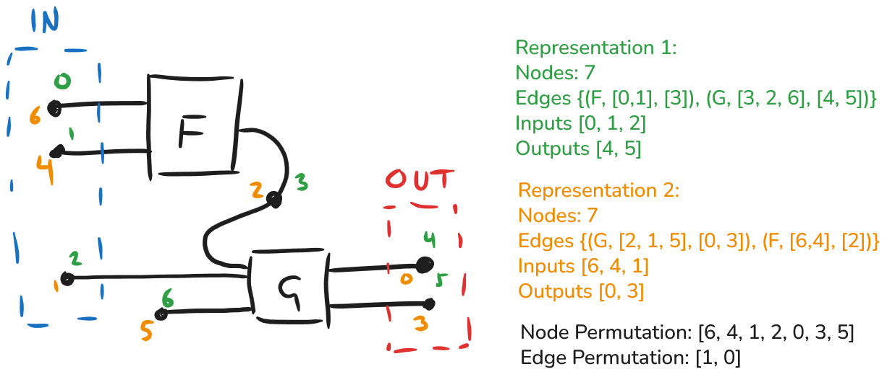

# An Explanation of the Open Hypergraph Isomorphism Approach

This page describes the mathematical folrmulation of hypergraph isomorphism as implemented in this package. If you are looking for a code-level explanation of the algorithm, please see the [isomorphism API documentation](../api/isomorphisms.md).

## Monogamous, Cartesian string diagrams

In this instance the algorithm we will be dealing with string diagrams which have the following restrictions:

- There is no splitting or joining of wires
    - This means that if a node has a preceding or following edge, then it is unique.

Cycles are permitted.

### Global inputs and outputs

There exists a subset of wires (nodes) which are global inputs and outputs for the purposes of composing diagrams.
If there are $n$ global inputs there is an injection from $\{1 ... n\} \rightarrow \text{Nodes}$ which uniquely identifies each input node. (Likewise for global outputs.)

All wires / boxes in the string diagram (nodes / hyperedges in the hypergraph) are connected to at least one global input or output by some path. There are no disconnected subgraphs (or these can be ignored).

### Example graph and representations

Consider the following graph and two representations that we need to test for isomorphism.

The green numbers label nodes with their index in representation 1, and the gold numbers label nodes with their index in representation 2. Note that both the nodes and edges are represented in a different order.

From the (ordered) global input and output lists, the beginning of the node permutation can be immediately deduced:

$\pi^n = [6, 4, 1, -, 0, 3, -]$

By traversing the graph we can check that the nodes connect to edges of the correct type and in the correct way (correct input/output port), and visit the internal nodes not yet accounted for.

Note that back-tracking from an edge (exploring inputs as well as outputs) is necessary in the traversal algorithm to ensure that node 6 (in representation 1) can be reached from an input/output.

## The Isomorphism algorithm

### Overview

For two graphs being compared, we want to find (if there exists) a permutation of the node / edges lists which transforms one graph into the other or, equivalently, a one-to-one mapping between the nodes and edges of each graph.

Since the global input and output nodes are already uniquely identified by the mapping described in the previous section, we can immediately identify the nodes which map to the same global input or output.

We then proceed to compare the graphs through a graph traversal starting from each global input/output node. The graph traversal proceeds until a contradiction is met (non-isomorphic) or all nodes and edges have been visited (isomorphic). We will maintain a list of visited nodes to prevent looping around cycles or back-tracking through paths we have already covered.

### Details

**Throughout, we will use the subscript 1 to indicate an element in the graph $g_1$, and the subscript 2 to indicate a corresponding element in graph $g_2$; e.g. a node $n_1$ is in $g_1$ and a node $n_2$ is in $g_2$.**

The graph traversal is shared between two mutually recursive functions: one traversing from a pair of matching nodes $(n_1, n_2)$, and one traversing from a pair of matching edges $(e_1, e_2)$. Over the course of the traversal we will build up permuation functions for the nodes ($\pi^n$) and the edges ($\pi^e$). Since not all of the graph will necessarily be accessible from a single global input or output, the algorithm will begin a traversal from each gloabl input and output.

A permutation for nodes (edges) is stored as a list the size of the number of nodes (edges). The element $\pi[i] = j$ indicates a mapping from $n_i \rightarrow n_j$ ($e_i \rightarrow e_j$). Initially all elements of $\pi$ are set to a null value. As the array is updated, it can be used to check for any contradictions in the mapping (many-one or one-many mappings) that would indicate non-isomorphism.

#### Updating the permutations through a graph traversal

The permutations are updated as we walk the graph in the following way:

1. If $n_1$ and $n_2$ are global inputs or outputs then, if the graphs are isomorphic, we must have $\pi^n(n_1) = n_2$.
2. If we have $\pi^n(n_1) = n_2$, and the successes hyperedges are $(e_1, e_2)$, then by monogamicity we require $\pi^e(e_1) = e_2$ if the graphs are isomorphic.
    - For edges to be isomorphic they must also be checked for their label and (co-)arity.
3. Because the inputs and outputs to a hyperedge are ordered, we can identify further pairs of matching nodes between the two graphs and update the permutation.
4. We can then continue on updating the permutation as we alternate between nodes and edges.

If graphs are non-isomorphic then updating the permutations may lead to a contradiction. As we traverse the graph, pairs of nodes/edges are passed into the permutation update functions as candidates, and the update function will determine if the update is valid.

For a candidate pair of nodes $(n_1, n_2)$:

1. If there is no mapping from $n_1$ or to $n_2$, then the candidate is accepted and the permutation is updated $\pi^n[n_1] = n_2$.
2. If there there is an existing entry $\pi[n_1] = n_2$ then the candidate is consistent with the permutation discovered so far, and the candidate is accepted but no update needs to happen.
3. If there is an existing entry $\pi[n_1] = (n^\prime_2)$ then there is a contradiction and the graphs are non-isomorphic.
4. If there is an existing entry $\pi[n^\prime_1] = n_2$ then there is a contradiction and the graphs are non-isomorphic.

Updating the edge permutation works likewise.

#### Step by step algorithm

1. Check that the size of the node, edge, global input, and global output lists in $g_1$ and $g_2$ are equal.
2. For each global input/output:
    - identify the corresponding nodes $n_1$ and $n_2$ (in the graphs $g_1$ and $g_2$ respectively).
    - Call node traversal from $(n_1, n_2)$.
    - If non-isomorphism is found we can return `False` early.
3. If traversal from all inputs/outputs are successful then we can return `True` (along with the node and edge permutations).

Traversal from a node pair $(n1, n2)$:

- If a node $n_1$ has already been visited, check that the permutation $\pi(n_1) = n_2$ is present and consistent. If there is a contradiction, return non-isomorphic. Otherwise, you may stop this branch of the traversal here.
- If $n_1$ has not been visited before then check that $n_2$ is not already mapped in the permutation; if $n_2$ already exists in the permutation then return non-isomorphic. Otherwise update the permutation $\pi(n_1) = n_2$, add $n_1$ to the list of visited nodes, and proceed.
- Identify the preceding and following edges where they exist. For each of these pairs compare:
    - If $e_1$ exists, then $e_2$ must exist. Otherwise return non-isomorphic.
    - $e_1$ and $e_2$ exist, then they must match in label, size of inputs, and size of outputs.
    - Call an edge traversal from $(e_1, e_2)$.

Traversal from an edge pair $(e_1, e_2)$:

- If an edge $e_1$ has already been visited, check that the permutation $\pi^e$ is consistent. If there is a contradiction, return non-isomorphic. Otherwise stop this branch of the traversal here.
- If the edge has not been visited before, check that $e_2$ is not already mapped in the permutation; if $e_2$ already exists in the permutation then return non-isomorphic. Otherwise update the permutation $\pi^e(e_1) = e_2$, add $e_1$ to the visited edges list, and proceed.
- Inputs and outputs to a hyperedges are _ordered_, which means that if two graphs are isomorphic we should be able to identify candidate pairs of nodes $(n_1, n_2)$ by iterating over the input/output lists of the edges $(e_1, e_2)$.
    - For each corresponding pair of nodes $n_1$ and $n_2$, taken from the input or output lists of $e_1$ and $e_2$:
        - Perform the node graph traversal from the pair $(n_1, n_2)$. If we have already been down this path before it will return immediately.

### Correctness

- An open hypergraph is a list of $N$ nodes and $E$ edges.
- Nodes can be simply numbered $\{0, ..., N-1\}$.
- An edge $e$ contains an ordered list of inputs $e.I$, an ordered list of outputs $e.O$, and a label $e.L$ which determines what morphism it represents.

If two graphs $g_1$ and $g_2$ are isomorphic, then there is a permutation (one to one mapping) of node list $\pi^n$, and a permutation of the edge list $\pi^e$, such that if $e_2 = \pi^e(e_1)$ then:

1. $e_1.L = e_2.L$
2. $\forall i. \pi^n(e_1.I[i]) = e_2.I[i]$
3. $\forall i. \pi^n(e_1.O[j]) = e_2.O[i]$

For open hypergraphs we furthermore have _global_ inputs ($I$) and outputs ($O$) and the node permutation satisfies

4. $\forall i. pi^n(I_1[i]) = I_2[i]$
5. $\forall i. pi^n(O_1[i]) = O_2[i]$

The graph traversal algorithm will visit all nodes and edges which are accessible by any path from the input and output set, and directly compare the two graphs to check for any contradictions (non-isomorphism).

- All nodes and edges will be visited and assigned in the permutation.
- The permutation vectors define a one-to-one mapping.
- If the graphs are isomorphic then the recovered permutations will obey the isomorphism properties given above.

Properties 4 and 5 are guaranteed by the first step of the algorithm mapping inputs and outputs.

In the Cartesian case, all the nodes and edges are connected to at least one input or output by some path. The algorithm explores all possible paths from the input and output, since it launches a search from each input and output.

- A given node can only be the output of at most one hyperedge and the input of at most one hyperedge, since there is no wire splitting. Therefore there are only two possible edges to explore from each node. These are explored in turn.
- From a given edge, the algorithm explores all nodes directly reachable by iterating over the inputs and outputs.
- If a node or edge has been explored already then paths from this point do not need to be iterated over again. The algorithm asserts that there is no violation of the mapping. (E.g. if we reach the pair $(n_1, n_2)$ but we already have a mapping $\pi^n(n_1) = n^\prime_2$ or $\pi^n(n^\prime_1) = n_2$.)

- Since the permutations are updated every time a new node or edge is visited, and every node and edge is visited, this means that the permutations must be complete and satisfy a one-to-one mapping if the algorithm completes without returning non-isomorphism early.
- Since the labels of the edges are checked when edges are visited and added to the permutation, and inputs and outputs of every edge are checked in the permutation as we traverse the graph, we also satisfy properties 1-3.

## Disconnected sub-graphs

Disconnected subgraphs can be calculated by graph traversal. We will assume that we have identified sub-graphs $g_1 = \cup_i g^i_1$.

The number of disconnected sub-graphs in $g_1$ and $g_2$ must be the same, which can be used as an initial check. Any sub-graphs which connect to the global inputs and outputs can be checked for isomorphism using the graph traversal algorithm described above.

We are then left with a collection of disconnected sub-graphs for $g_1$ and $g_2$. Isomorphism requires that there is a one to one mapping between subgraphs $\pi^g$ such that:

$\pi^g(i) = j \implies g^i_1 \cong g^j_2$

In other words, the sub-graphs of $g_1$ and $g_2$ must form pairs related by isomorphism. Note that these pairs are not necessarily unique, since we can have multiple identical sub-graphs.

To find valid pairs of sub-graphs we can initially apply simple checks such as size checks, but a graph traversal will be required for some (potentially all) candidates depending on the similarity of the subgraphs.

### Comparing two sub-graph isomorphism candidates

We shall assume that we have a pair of connected subgraphs $g^\prime_1$ and $g^\prime_2$ that have no paths to global inputs/outputs. Each sub-graph is monogamous but may contain cycles.

Since the subgraph is fully connected, the (non)isomorphism can be established by simple traversal as soon as a single matching pair has been definitively identified. By this we mean a pair $(n_1, n_2)$ such that $g^\prime_1 \cong g^\prime_2 \implies \pi^n(n_1, n_2)$. For example, if only one node in $g_1$ has no preceding edge, and a following edge labelled $F$, and likewise in $g_2$, then these nodes would have to be identified with one another if an isomorphism is to exist. Since the graph is fully connected, a traversal from the pair $(n_1, n_2)$ will visit all nodes and edges.

Strategies for identifying candidate pairs of nodes quickly may vary in success depending on the nature of the graphs. In the general (worst) case, this can be found by selecting a node $n_1$ from $g_1$ and iterating over possible nodes in $g_2$, returning early if a contradiction is reached. This amounts to a depth-first search of possible solutions. Nodes which are easily ruled out by initial checks (such as checking next/previous edge) will return very quickly. The list of possible candidates can be made shorter and easier to search by some existing sorting on Nodes based on their connecting edges. This kind of search does parallelise strongly since candidates can be explored entirely independently.

A linear time transformation to a canonical representation would avert the need for a depth first search.
